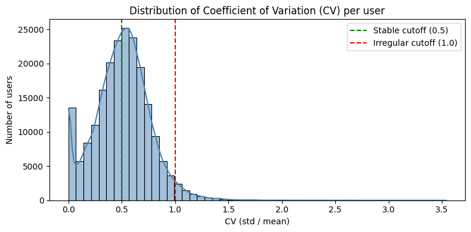
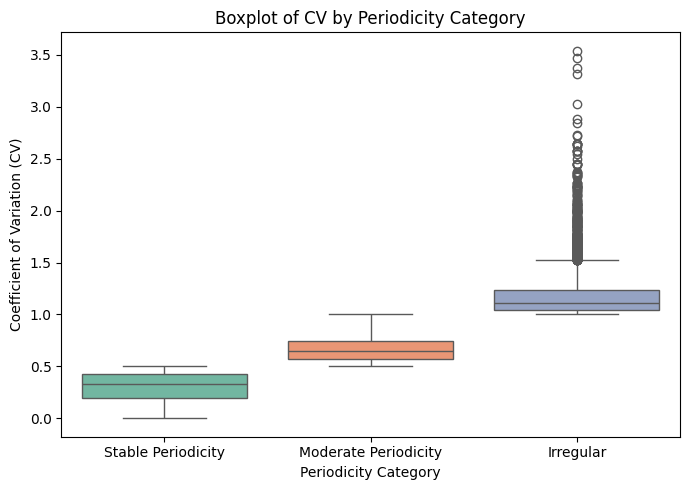
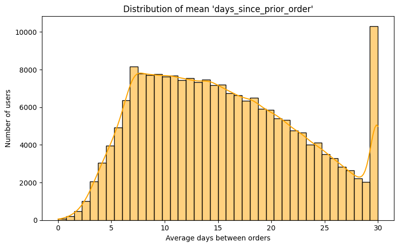

## 1. Distribution of Coefficient of Variation (CV) per User

**Purpose:**  
To examine how stable or irregular the shopping behavior is across all users.

**Explanation:**  
This histogram shows the distribution of the Coefficient of Variation (CV), calculated as the ratio between the standard deviation and the mean of purchase intervals (`days_since_prior_order`) for each user.  
- The **green dashed line (CV = 0.5)** marks the threshold separating stable and moderately stable purchasing patterns.  
- The **red dashed line (CV = 1.0)** represents the boundary beyond which purchase behavior becomes irregular or random.

**Interpretation:**  
- Nearly half of all users have CV values **below 0.5**, indicating highly consistent and regular shopping intervals.  
- Another **similarly large group (CV between 0.5 and 1.0)** shows moderate variation but still follows a fairly regular rhythm.  
- Only a very small fraction of users (CV > 1.0) exhibit irregular or random purchase timing.

**Conclusion:**  
The distribution demonstrates that the majority of users exhibit **stable or moderately stable periodicity**, confirming that purchasing behavior in the Instacart dataset is **not random**.  
Therefore, purchase frequency and regularity can be considered **reliable behavioral indicators** for subsequent clustering or recommendation modeling.

## 2. Boxplot of CV by Periodicity Category

**Purpose:**  
To verify whether the defined periodicity categories (Stable, Moderate, Irregular) represent statistically distinct user groups.

**Explanation:**  
Each boxplot shows the distribution of Coefficient of Variation (CV) values within one of the three categories:
- The **Stable Periodicity** group has low CV values (below 0.5) and a narrow interquartile range, indicating very consistent purchase intervals.  
- The **Moderate Periodicity** group has slightly higher CV values (roughly 0.5–1.0) and moderate dispersion, reflecting users who shop regularly but not strictly on a fixed schedule.  
- The **Irregular** group displays the highest CV values (above 1.0) and a wide spread with numerous outliers, suggesting unpredictable purchase behavior.

**Interpretation:**  
The three groups form **clearly separated distributions**, confirming that the chosen thresholds (0.5 and 1.0) effectively distinguish user behavior types.  
The visualization also validates that the classification into Stable, Moderate, and Irregular periodicity is **statistically meaningful** and consistent with the underlying data.

**Conclusion:**  
The boxplot supports the validity of the CV-based segmentation.  
Users differ not only in how often they purchase but also in **how consistent their timing** is, which can later guide personalized recommendation strategies.

## 3. Distribution of Mean `days_since_prior_order`

**Purpose:**  
To identify the most common shopping intervals among users and detect potential periodic patterns in purchasing frequency.

**Explanation:**  
This histogram shows the distribution of the *average number of days between consecutive orders* (`days_since_prior_order`) for each user.  
Each bar represents how many users have a given average order interval.  
The orange line (KDE curve) illustrates the overall density of these values.

**Interpretation:**  
- The highest concentration appears between **5 and 10 days**, indicating that many users follow a **weekly shopping cycle**.  
- A secondary increase occurs around **30 days**, suggesting another group of users that shop roughly **once per month**.  
- The distribution decreases gradually between these peaks, implying intermediate shopping frequencies (e.g., biweekly).

**Conclusion:**  
This analysis reveals **two dominant shopping rhythms** within the Instacart dataset — weekly and monthly.  
These patterns confirm that users exhibit periodic shopping behavior rather than random activity,  
which can be leveraged for **next purchase prediction** or **personalized reminder systems**.
