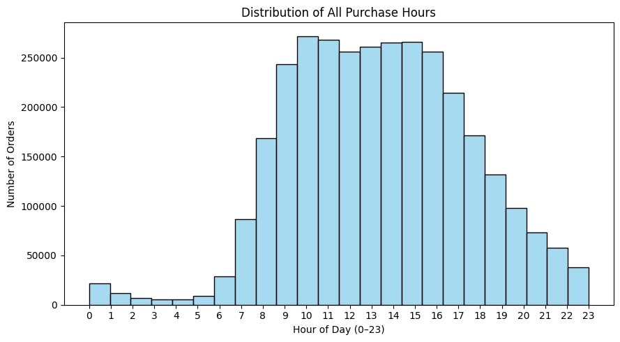
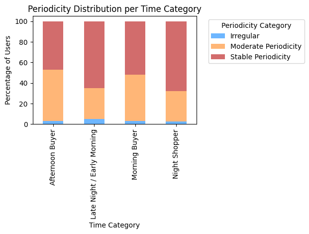

## Using Time-of-Day Information in User Analysis

**Purpose:**  
The distribution above shows the number of orders placed at each hour of the day (0–23).  
It provides insights into when users are most active and helps identify daily shopping patterns.

**Interpretation:**  
- The vast majority of orders occur between **9:00 and 17:00**, with a clear peak between **10:00 and 15:00**.  
- Very few purchases happen late at night (after 21:00) or before 7:00.  
- This confirms that online grocery activity follows a strong **daytime pattern**, concentrated around midday and early afternoon.

**How to use this information:**  
1. **Feature for Clustering:**  
   Include the average purchase hour (`mean_order_hour_of_day`) as a behavioral feature.  
   Users who shop early (morning) or late (evening) may represent distinct lifestyle patterns.  

**Conclusion:**  
The hourly purchase distribution demonstrates that time-of-day is a **predictable and stable behavioral signal**.  
While it may not require a separate model, it adds valuable context for **user segmentation** and **time-aware recommendation systems**.

## 4. Relationship Between Purchase Time and Periodicity

**Purpose:**  
To examine whether users who shop at different times of day (morning, afternoon, night)  
also differ in how consistently they place their orders over time.

**Method:**  
User-level datasets were merged by `user_id` to combine:
- the **time category** (Morning, Afternoon, Night, Late Night) derived from the average purchase hour, and  
- the **periodicity category** (Stable, Moderate, Irregular) based on the coefficient of variation (CV).  

The resulting table shows the percentage of users within each time group belonging to each periodicity class.

| Time Category | Stable | Moderate | Irregular |
|----------------|---------|-----------|------------|
| Afternoon Buyer | 46.9% | 50.1% | 2.9% |
| Morning Buyer | 51.8% | 44.9% | 3.3% |
| Night Shopper | 67.8% | 29.5% | 2.7% |
| Late Night / Early Morning | 65.0% | 30.1% | 4.9% |

**Interpretation:**  
- **Morning Buyers (≈52% Stable):** show slightly higher stability than the overall user average, indicating consistent routines.  
- **Afternoon Buyers (≈77% of total users):** are evenly split between Stable and Moderate periodicity, showing more flexible but still regular habits.  
- **Night Shoppers (≈68% Stable):** though few, they are the most regular group, likely following a consistent late-hour shopping routine.  
- **Late Night / Early Morning Users:** display high stability as well, but their group is extremely small, so the result may not be statistically reliable.

**Insights:**  
This analysis reveals a clear relationship between *time-of-day preference* and *purchase regularity*.  
Morning and night shoppers are more predictable in their shopping intervals,  
while afternoon users exhibit more variability.  
Therefore, **time-of-day behavior provides additional explanatory power** for clustering and can help personalize recommendations for different user types.

**Conclusion:**  
The results demonstrate that temporal shopping patterns (when users shop)  
are linked to behavioral consistency (how regularly they shop).  
Incorporating both features enhances the quality of user segmentation and improves the foundation for time-aware recommendation systems.
